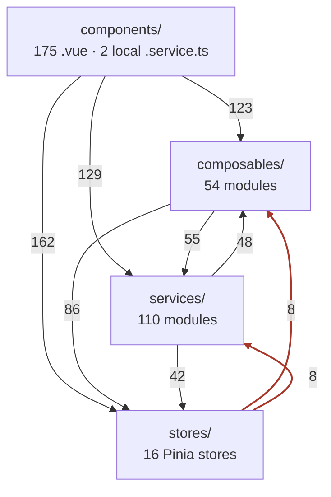
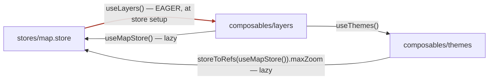

# Architecture: stores, services, composables, components

How the four layers actually depend on each other, derived from a full import-graph pass over
`src/` (every relative and `@/` import resolved, Tarjan over the result).

**Provenance:** branch `main` @ `44ac341`. Excludes the GSLUX-815 branch work. Specs, tests and
fixtures are omitted from all edge counts.

| | |
|---|---|
| Components | 175 `.vue` |
| Service modules | 110 |
| Composable modules | 54 (36 are `*.composable.ts`) |
| Pinia stores | 16 |
| Import cycles | **9** |

The four-layer table in `AGENTS.md` and `CONTRIBUTING.md` is a **naming convention, not a
dependency hierarchy**: components sit cleanly on top, and everything underneath them is mutually
cyclic. `AGENTS.md` states that conclusion; this document is the evidence for it.

---

## 1. Components layer cleanly. Nothing below them does.

Every component-to-anything edge points downward, and there is not a single edge from a store,
service or composable back up into a component. Below that line the three remaining layers
import each other in both directions.

Distinct file-to-file import pairs:

| From | To | Pairs | |
|---|---|--:|---|
| component | store | 162 | expected |
| component | service | 129 | expected |
| component | composable | 123 | expected |
| composable | store | 86 | expected |
| composable | service | 55 | peer |
| service | composable | 48 | peer |
| service | store | 42 | expected |
| store | service | 8 | **inverted** |
| store | composable | 8 | **inverted** |

Two things to read off this:

- The **red edges** are real inversions — eight store modules import a composable and eight
  import a service.
- The **55 / 48 pair** is a genuinely undirected band. Services and composables import each
  other at nearly equal weight, so neither is "above" the other.

---

## 2. Services are singleton objects, not stateless functions

`CONTRIBUTING.md` calls them "Shared Stateless services". Thirty-six modules under `src/services/` end in
`export const x = new X()`, and sixty-five declare a class. They hold state, and some run side
effects at import time.

> **Import-time side effect** — `services/state-persistor/storage/storage.helper.ts:9`
> The `StorageHelper` constructor reads the persisted schema version and then calls
> `setValue(SP_KEY_VERSION, 3)`, **writing to the URL**. That happens the moment any module
> imports the singleton, before any component mounts.

Read `src/services/` as "app-wide injectables with methods" rather than as pure functions. The
genuinely stateless members are the seventeen `*.utils.ts` and `services/api/*` modules;
thirty-one service files import a store and thirty-three import a composable.

### Two service idioms, two sets of rules

| Location | Count | May touch a store? | Shape |
|---|--:|---|---|
| `src/services/…` | 110 | yes — 31 do | class + exported singleton |
| `components/<feature>/<feature>.service.ts` | 2 | no | class + exported singleton, pure methods |

Only `layer-tree` and `theme-selector` have a component-local service.
`components/layer-tree/layer-tree.service.ts` is the cleanest unit in the repo: recursive tree
transforms, type-only imports, no store access, no Vue reactivity. It is the template worth
copying.

---

## 3. Several composables are not composables

Of the thirty-six `*.composable.ts` files, five use no Vue reactivity API at all. They are
function namespaces invoked as `useLayers().foo()` — which is exactly why a *store* can legally
call one.

| Kind | Count | Examples |
|---|--:|---|
| Lifecycle-bound — uses `onMounted`/`onUnmounted` | 9 | `control`, `measure`, `routing`, `profile-position` |
| Reactive but not lifecycle-bound | 22 | `draw`, `feature-info`, `background-layer`, `themes` |
| **No Vue reactivity at all** — a function namespace | 5 | `layers`, `ol`, `mvt-styles`, `mobile-tile`, `offline-layers` |
| **Module-level mutable state** — a de facto singleton | 3 | `map`, `my-maps`, `mobile-tile` |

`composables/map/map.composable.ts:23` declares `let map: OlMap` at module scope, so `useMap()`
is a global OpenLayers registry wearing composable clothing. It is also the most widely imported
symbol in the codebase — **56 files**: 22 components, 17 composables, 17 services.

---

## 4. Lazy store resolution is what keeps this standing up

No service and effectively no composable calls `useXStore()` at module top level. Every one
resolves its store *inside* the method that needs it:

- `composables/themes/themes.composable.ts:61, :76, :103` — `const { themes } = useThemeStore()`
  inside `findByIdOrName`, `findThemeNamesByLayerId`, `find3dLayerById`
- `composables/layers/layers.composable.ts:232, :281` — `const mapStore = useMapStore()` inside
  the exclusion handlers

This is the single convention holding the cyclic graph together. It keeps Pinia from being
touched before `createPinia()`, and it lets the circular ES-module imports resolve because
nothing dereferences the other half at evaluation time.

> **One violation** — `composables/lidar/draw-lidar-interaction.composable.ts:23` calls
> `useMatomo()` at module scope. It happens to be safe today because `useMatomo` is not a Pinia
> store, but it breaks the pattern the rest of the codebase relies on.

---

## 5. Nine strongly connected components

| Size | Layers spanned | Members | Note |
|--:|---|---|---|
| 8 | component, composable, service, entry | `App.vue`, `bundle/lib.ts`, `footer-bar.vue`, `toolbar-print.vue`, `print.composable`, `jobStatus.composable`, `print.service`, `LuxEncoder` | drags in both entrypoints |
| 4 | store, service, composable | `draw.store`, `draw-utils.composable`, `ol-feature-drawn`, `api-mymaps.service` | crosses all three |
| 3 | store, composable | `map.store`, `layers.composable`, `themes.composable` | **hottest path** |
| 3 | store, composable | `map.store.model`, `themes.model`, `offline.model` | types only — harmless |
| 3 | component, service | `lidar/plot.ts`, `lidar-manager`, `lidar-measure` | service reaches into a component |
| 2 | store, composable | `style.store`, `mvt-styles.composable` | store calls composable |
| 2 | service | `ol-layer-feature-position.helper`, `ol-layer.model` | intra-layer |
| 2 | service | `state-persistor.model`, `storage/url-storage` | intra-layer |
| 2 | component | `d3-graph-elevation.vue`, `elevation-profile.vue` | intra-layer |

### The hottest one, drawn out

`map.store.ts:9` calls `useLayers()` in the `defineStore` setup body so `setLayerTime` can reach
`getLayerCurrentLabel` when a WMTS layer's time changes. The two composables reach back for
`useMapStore`, but only from inside their own functions — the red edge is the only one evaluated
eagerly, and that is why the cycle resolves rather than exploding.

---

## 6. The state-persistor is the one fully consistent convention

`services/state-persistor/` is twenty-eight modules and the most disciplined corner of the
codebase. Eleven of its twelve persistor services implement the same
`bootstrap()` → `restore()` + `persist()` triple; only `state-persistor-featureinfo` omits
`persist()`. Direction is strictly one-way: the service knows the store, the store has no idea
it is persisted.

The five `*.mapper.ts` files are the only pure pieces — they translate between storage strings
and typed state and touch nothing else, which is why they are also the easiest things here to
unit-test.

> **Fragile coupling** — the twelve `bootstrap()` calls are spread across **five files**:
> seven in `App.vue:62-69`, three in `components/map/map-container.vue:89-91`, one in
> `components/header-bar/language-selector.vue:26` and one in
> `components/slider/slider-comparator.vue:52`. The last two therefore only run *if their
> component mounts*. The `App.vue` block is hand-ordered and load-bearing, but the only thing
> recording that is the comment `// Important, keep order!` — no dependency is declared, no
> reason is given per line, and nothing enforces it. `bundle/lib.ts` duplicates the sequence
> independently, so the two entrypoints can drift apart silently.

---

## 7. How components actually reach the other three

Of 175 `.vue` files:

| Pattern | Files | Share | Most imported |
|---|--:|--:|---|
| Imports at least one service | 93 | 53% | `info/feature-info.model` — 45 |
| Imports at least one store | 76 | 43% | `app.store` — 31 |
| Imports at least one composable | 64 | 37% | `map.composable` — 22 |
| Uses `storeToRefs` | 51 | 29% | — |

Services look like the most-consumed layer, but read the top row carefully: the two heaviest
component→service imports are `info/feature-info.model` (45) and `ol-feature/ol-feature-drawn`
(20) — a model and a class used as a type. Components mostly pull *types* out of
`src/services/`; only five components import a state-persistor service at all.

Where behaviour is concerned, components **mutate stores directly**. There is no action or
command layer: `layer-manager/layer-manager.vue` calls `mapStore.reorderLayers`,
`setLayerOpacity`, `setLayerTime` and `removeLayers` straight from its event handlers
(`:65`, `:73`, `:77`, `:85`). Components also call service singletons directly, and `App.vue`
bootstraps them.

`catalog/catalog-tree.vue` is the canonical all-three consumer: three stores, two composables, a
component-local service and a mapper, wired together in `watchEffect` blocks that rebuild the
tree whenever theme or layer state moves.

---

## 8. The layering shows up as a mocking burden

66 spec files by layer:

| Layer | Specs | Setup needed |
|---|--:|---|
| `src/services/` | 36 | Pinia and/or composable mocks |
| `src/components/` | 24 | `createTestingPinia` + mount |
| `src/composables/` | 6 | Pinia |
| `src/stores/` | 2 | minimal |

Services are the most-tested layer and the most expensive to test, precisely because thirty-one
of them reach into stores. Eighteen spec files instantiate `createTestingPinia`, and
`themes.composable` is `vi.mock`ed in three separate *service* specs. By contrast
`layer-tree.service`, the state-persistor mappers and the `*.utils.ts` modules test with no setup
at all — which is the practical argument for keeping new logic pure.

---

## 9. Rules that hold today

1. **Data flows down through stores; behaviour flows up through composables and services.**
   Components read state and mutate it directly — do not invent an action layer for one feature.

2. **Anything outside a component that reads a store must resolve it lazily, inside the
   function.** A top-level `const store = useXStore()` in a service or composable is a latent
   Pinia-ordering bug.

3. **Types live in `*.model.ts` beside their owner and cross every layer freely.** That accounts
   for most of the harmless cycles — a type-only SCC is not a problem worth solving.

4. **Pick the home by what the code needs, not by what it is called:** a *store* for shared
   state, a *composable* when you need Vue reactivity or a component lifecycle, a *service* in
   `src/services/` for app-wide behaviour, and a *component-local service* for pure feature logic
   that should stay testable.

5. **New persistence goes through the `bootstrap`/`restore`/`persist` triple with a mapper** —
   and gets registered in *both* `App.vue` and `bundle/lib.ts`.
