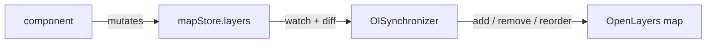

# Onboarding — Geoportail Luxembourg v4

Welcome. This is the practical guide to getting productive here: what the app is, how to run it,
where things live, and the handful of non-obvious rules that the codebase actually relies on.

Read this first, then [`ARCHITECTURE_ANALYSIS.md`](./ARCHITECTURE_ANALYSIS.md) when you want the measured detail on
how the layers depend on each other.

> **Scope note.** This describes `main`. The project has a **web-component / library mode** for
> embedding into the legacy geoportal v3 — you will find a lot of documentation about it in
> `README.md`. **That mode is no longer really used.** Development today is the **standalone Vue
> application**. Everything below assumes app mode; the lib-mode leftovers are called out in
> [§11 What's stale in the docs](#11-whats-stale-in-the-docs) so you can skip them without
> wondering whether you missed something.

---

## 1. What this application is

The Luxembourg national geoportal — the public map viewer at `geoportail.lu`. A Vue 3 + TypeScript
SPA built on **OpenLayers**, with vector-tile basemaps styled through **Mapbox GL style specs**.

It is the **v4 rewrite** of a legacy Angular/AngularJS app (**v3**). v3 still exists and still owns
the backend: v4 has **no backend of its own**. Every API call goes to a v3 host or to the migration
platform (`https://migration.geoportail.lu`). That single fact explains most of the local-setup
friction you are about to hit.

What the app does, roughly one feature folder per capability:

| Area | Folders |
|---|---|
| Map & controls | `map`, `map-controls`, `slider` (side-by-side comparator) |
| Layers | `catalog`, `layer-tree`, `layer-panel`, `layer-manager`, `layer-metadata`, `background-selector`, `theme-selector`, `remote-layers`, `legends` |
| Drawing & user data | `draw`, `my-maps`, `export`, `share` |
| Query & analysis | `search`, `info`, `routing`, `lidar`, `feature-elevation-profile` |
| Shell & cross-cutting | `header-bar`, `footer`, `side-panel`, `alert-notifications`, `auth`, `feedback`, `offline`, `common` |

---

## 2. Day one: get it running

```bash
nvm use            # .nvmrc pins Node 22
npm ci
npm run start      # alias for `npm run dev` → vite --force, http://localhost:5173
```

That is genuinely all you need for the map to appear. But two things will confuse you within the
first ten minutes:

### The themes you see are a fixture, not the API

`config.store.ts` fetches `/themes?…` on startup. Vite's dev server **does not proxy `/themes`**
(check the `server.proxy` block in `vite.config.ts` — it is not in the list). So the request 404s
and the store silently falls back to `src/__fixtures__/themes.api.fixture.ts` — a 2 MB snapshot of
the real themes API.

This is deliberate and it is why the app runs with no backend. Consequences:

- The layer catalog you develop against is a **frozen snapshot**. If a layer looks wrong, check the
  fixture before blaming your code.
- The fallback only happens in `DEV` / `e2e` mode (see `config.store.ts:60-80`). In production a
  failed themes fetch means an empty app.

### Most other features need v3 running, plus a CORS browser plugin

MyMaps, authentication, MySymbols, print, feature info and the shop links all call out to a v3 host
or the migration platform. Because v4 is served from a different origin, you need a
**CORS-disabling browser extension** for these to work in dev (e.g. "Allow CORS" for Chrome).
Without it those features fail with opaque network errors.

For authentication specifically you need a local v3 docker composition and matching env changes on
both sides — `README.md` §🔒 has the exact steps. Do not attempt this on day one.

### What works with no setup at all

Map rendering, background switching, the layer catalog and tree, permalink/URL state, drawing
geometry locally, measure tools, the style editor, unit tests. That is enough surface to make a
first real change.

---

## 3. The environment maze

Four `.env` files, and it is not obvious which applies:

| File | Mode | When it applies |
|---|---|---|
| `.env.development` | `development` | **`npm run dev` — this is the one you edit** |
| `.env.e2e` | `e2e` | unit tests and all e2e runs |
| `.env.staging` | `staging` | lib built in dev mode — legacy, ignore |
| `.env` | `prod` | production; today only used for lib builds — legacy |

Note that `npm run test:unit` runs `dotenv -e .env.e2e -- vitest`, so **unit tests read
`.env.e2e`, not `.env.development`**. If a test behaves differently from the dev server, compare
those two files first.

`NODE_ENV` and Vite's *mode* are different concepts — see
<https://vitejs.dev/guide/env-and-mode>.

Env vars are also read at **module scope** in places, not just inside functions — e.g.
`VITE_EXCLUDED_PARENT_LAYER_IDS` is `JSON.parse`d into a module constant in
`components/layer-tree/layer-tree.service.ts:7`, and `VITE_DEFAULT_MAX_EXTENT` in
`composables/map/map.composable.ts`. Changing those requires a dev-server restart, not just a
reload.

---

## 4. Where things live

```
src/
  main.ts              app entry: i18next init → mount → loadThemes()
  App.vue              layout + most state-persistor bootstrapping
  components/<feature>/ one flat folder per feature — see §1 table
    common/            shared dumb components
  composables/<area>/  <name>.composable.ts
  stores/              <name>.store.ts — Pinia, all shared state
  services/            app-wide behaviour, mostly exported singletons
  lib/                 hand-rolled OL/Mapbox wrappers + namespacedLogger
  directives/          Vue directives (format-measure)
  __fixtures__/        themes snapshot + test fixtures
  bundle/lib.ts        legacy web-component entry — not used day to day
public/assets/locales/ translation JSON, served at runtime
cypress/e2e/           e2e specs
tools/translations/    i18n sync/transform scripts
```

Feature folders are **flat, one level, no nesting**. One "smart" component per folder, named after
the folder. Reusable dumb components go in `components/common/`.

---

## 5. The four layers, honestly

`AGENTS.md` presents a clean table: components → composables → services → stores. The real import
graph is measured in [`ARCHITECTURE_ANALYSIS.md`](./ARCHITECTURE_ANALYSIS.md). The short version:

- **Components layer cleanly.** All component edges point downward; nothing below ever imports a
  component (with one exception in `lidar`).
- **Everything below components is mutually cyclic.** Stores import composables and services;
  services import composables and stores; composables import both. There are **nine import
  cycles**.
- **"Services are stateless"** — as `CONTRIBUTING.md` still puts it — **is not true.** Thirty-six of
  them export a `new X()` singleton and sixty-five declare a class. Read `src/services/` as
  "app-wide injectables with methods".
- **Some composables are not composables.** Five use no Vue reactivity at all and are just function
  namespaces; three hold module-level state and are effectively singletons.

Don't try to fix this on your first ticket. Do learn to place *new* code well — see §8.

---

## 6. The five mechanisms you must understand

Read these five files, in this order. It is about an hour and it is the difference between guessing
and knowing.

### 1. `src/main.ts` — the bootstrap

i18next initialises **and resolves** before `app.mount()`. That ordering is deliberate (a Firefox
race where components rendered before translations existed). `useThemeStore().loadThemes()` fires
right after mount.

### 2. `src/App.vue` — layout + persistor bootstrapping

The whole app shell, and a hand-ordered block of `statePersistorXService.bootstrap()` calls under a
comment that reads only `// Important, keep order!`. See §7.

### 3. `src/stores/map.store.ts` — the state model

`mapStore.layers` is a `shallowRef<Layer[]>` and it is **the single source of truth for what is on
the map**. Every mutation replaces the array rather than editing in place (`addLayers`,
`removeLayers`, `reorderLayers`, `setLayerOpacity`, `setLayerTime`). Note the immutability: it is
what makes the next file work.

### 4. `src/composables/map/ol.synchronizer.ts` — **the keystone**

This is the most important file in the codebase. It `watch`es `mapStore.layers`, diffs old against
new, and translates the difference into imperative OpenLayers calls — add, remove, reorder, set
opacity, set time, swap the layer factory when the type changed (e.g. going offline).



**You never touch the OpenLayers map directly to show a layer.** You mutate the store and let the
synchronizer do it. `OlViewSynchronizer` does the same job for centre/zoom/rotation. Both are
instantiated once, in `components/map/map-container.vue:87-88`.

### 5. `src/components/catalog/catalog-tree.vue` — a real feature, fully wired

Three stores, two composables, a component-local service and a mapper, composed in `watchEffect`
blocks that rebuild the tree whenever theme or layer state moves. This is what a feature looks like
here.

---

## 7. The URL *is* the application state

`services/state-persistor/` (28 modules) serialises app state into the URL and `localStorage`, and
restores it on load. Permalinks are a first-class product feature, so this subsystem is load-bearing
and touched constantly.

Each persistor implements the same triple:

```
bootstrap()  →  restore()   read storage → mapper → write into the store
             →  persist()   watch(store, deep) → mapper → write to storage
```

Direction is strictly one-way: **the service knows the store; the store has no idea it is
persisted.** The `*.mapper.ts` files are pure and are the easiest things here to test.

### Two traps

**Bootstrapping is scattered across five files, not one.** Seven persistors start in
`App.vue:62-69`, three more in `map-container.vue:89-91`, and one each in
`header-bar/language-selector.vue:26` and `slider/slider-comparator.vue:52`. Those last two only
run **if their component mounts**. If a URL parameter is mysteriously ignored, find its
`bootstrap()` call site before anything else.

**The order is load-bearing and undocumented.** The only record is the comment
`// Important, keep order!`. No dependency is declared and nothing enforces it. Adding a persistor
means choosing a position in that list and being right about it.

Adding new persisted state? Copy an existing pair — `state-persistor-layers.service.ts` plus
`state-persistor-layer.mapper.ts` — and register the key in `state-persistor.model.ts`.

---

## 8. Making your first change

### Naming (enforced by review, not by lint)

| Thing | File | Symbol |
|---|---|---|
| Component | `kebab-case.vue` | `PascalCase` |
| Composable | `name.composable.ts` | `useName()` |
| Store | `name.store.ts` | `useNameStore()` |
| Service | `name.service.ts` | class + exported singleton instance |
| Model | `name.model.ts` | `interface Layer {}` — **no `Model` suffix on the interface** |

Also: no `_` prefix or suffix for private members.

### Where does my new code go?

- **Shared state** → a Pinia store. Components read it with `storeToRefs` and **mutate it
  directly** — there is no action/command layer, don't invent one for one feature.
- **Needs Vue reactivity or a component lifecycle** → a composable.
- **App-wide behaviour** → a service in `src/services/`.
- **Pure feature logic you want cheaply testable** → a component-local
  `components/<feature>/<feature>.service.ts`. `components/layer-tree/layer-tree.service.ts` is the
  model to copy: recursive transforms, type-only imports, no store access, no reactivity — and
  therefore a spec file with zero setup.
- **Types** → `*.model.ts` beside their owner. They cross every layer freely.

### The one rule that will bite you

> **Never call `useXStore()` at module top level in a service or composable.** Resolve it *inside*
> the function that needs it.

```ts
// ✗ latent Pinia-ordering bug, and breaks the circular imports
const mapStore = useMapStore()
export function doThing() { mapStore.addLayers(l) }

// ✓ what the rest of the codebase does
export function doThing() {
  const mapStore = useMapStore()
  mapStore.addLayers(l)
}
```

This is the single convention that keeps the cyclic import graph resolvable and keeps Pinia from
being touched before `createPinia()`. See `composables/themes/themes.composable.ts:61` for the
pattern. (`composables/lidar/draw-lidar-interaction.composable.ts:23` violates it; don't copy that
one.)

### Lint rules with teeth

- `no-console` is an **error**. Use `src/lib/logging/namespacedLogger` →
  `const { log } = createLogger('SW')`.
- `no-only-tests` is enforced. Never commit `.only`.
- Husky + lint-staged run `eslint --fix` and `prettier --write` on staged `.ts`/`.vue` on commit.

```bash
npm run lint          # eslint + prettier check
npm run format        # prettier write + eslint --fix
npm run type-check    # vue-tsc, one-shot
npm run type-check:dev  # keep it running while you work — recommended
```

Note `src/bundle/` and the fixtures are **excluded** from lint and type-check via `.prettierignore`.

---

## 9. Testing

```bash
npm run test            # Vitest, watch mode
npm run test:unit:ci    # with coverage → coverage/index.html
npm run test:e2e:dev    # Cypress UI against a vite dev server
npm run test:e2e:ci     # headless, what CI runs
```

Single file:

```bash
dotenv -e .env.e2e -- vitest --environment jsdom --root . src/path/to/file.spec.ts
```

Specs are co-located as `*.spec.ts`. Vitest globals are on, environment is jsdom, setup file is
`vitest.setup.ts`.

**What the test suite looks like today** — 66 spec files: 36 for services, 24 for components, 6 for
composables, 2 for stores. Services are both the most-tested and the most expensive to test,
because 31 of them reach into stores: eighteen specs need `createTestingPinia`, and
`themes.composable` is `vi.mock`ed inside three separate *service* specs. Pure units need none of
that. Keeping new logic pure is a testing decision as much as an architectural one.

E2E notes: coverage is instrumented with Istanbul when `INSTRUMENT_COVERAGE=true`, and Cypress runs
with `chromeWebSecurity: false` to bypass CORS. `data-cy` attributes are stripped from the template
in production builds (see the `removeDataTestAttrs` transform in `vite.config.ts`).

---

## 10. Git, PRs and CI

- **Branches** are named after the Jira ticket: `GSLUX-<number>-<short-slug>`, e.g.
  `GSLUX-815-persist-layer-groups-state`.
- **Commits on a branch** are conventionally prefixed `GSLUX-<number>: <what>`.
- **PRs target `main`** and are **squash-merged**, so `main` history is PR titles with `(#nnn)`.
- CI (`.github/workflows/lint-build-test.yml`) runs on PRs to `main`, on pushes to `main`, and on
  tags — Node 22, then `lint`, `type-check`, `build-only --mode=e2e`, `test:unit:ci`,
  `test:e2e:ci`.
- Merging to `main` auto-creates a tag `<branch>_CI_<short_commit>`. `npm run tag` creates a local
  `<branch>_DEV_<short_commit>` tag. Tags exist to trigger lib releases — mostly legacy now, and
  **clean up your own dev tags** (`README.md` has the one-liners).

---

## 11. i18n

Five namespaces: `app`, `layers`, `legends`, `server`, `tooltips`. Four languages: `fr` (default),
`de`, `en`, `lb`, fallback `en`.

Files live in **`public/assets/locales/<ns>.<lng>.json`** and are fetched at runtime by the
i18next HTTP backend (`main.ts:38`). Two i18next settings are unusual and deliberate:

- `nsSeparator: false` — some keys contain `:`, so namespace splitting must be off.
- `keySeparator: false` — keys are literal strings, not dotted paths.

Translations are managed in Transifex and synced with the `npm run i18n:*` scripts in
`tools/translations/`. You will rarely edit these JSON files by hand.

Two gotchas in that folder:

- There are duplicate `layers-<lng>.json` files alongside the real `layers.<lng>.json`. The
  loadPath is `{{ns}}.{{lng}}.json`, so **the dash variants are dead weight** and never loaded.
- `client.<lng>.json` files are all `{}` — empty. `README.md` describes them as carrying a copy of
  v3's keys; that is no longer the case.

---

## 12. What's stale in the docs

Here is what to trust and what to distrust in each doc, so you don't lose an afternoon.

| Doc | Trust it for | Distrust |
|---|---|---|
| `README.md` | scripts, `.env` explanation, auth setup, CORS advice | **the whole lib/web-component half** (§📦, tags, releases, importing into v3, webpack `CopyPlugin`) — that workflow is not used any more |
| `CONTRIBUTING.md` | naming, feature-folder rules, syntax rules | "Shared **Stateless** services" — they are singletons that read stores; and the example folder tree is idealised (`stores/` is flat, not `stores/map/`, and `layer-tree/` has no `layer-tree.vue`) |
| `AGENTS.md` | commands, the rules that matter, dev gotchas, i18n oddities, conventions | nothing known — it is the maintained summary. `CLAUDE.md` is only a one-line include of it |
| [`ARCHITECTURE_ANALYSIS.md`](./ARCHITECTURE_ANALYSIS.md) | measured import-graph reality, the cycles, the evidence behind the rules | nothing known — generated from `main` @ `44ac341`; re-derive if the tree has moved a lot |
| [`BEST_PRACTICES.md`](./BEST_PRACTICES.md) | what to do when writing new code | nothing known |

Lib mode has not been deleted — `src/bundle/lib.ts`, `vite-dist.config.ts` and the
`build:lib:*` scripts are all still there, and `bundle/lib.ts` still appears in the largest import
cycle. Treat it as **dormant**: don't build features for it, but if you touch `App.vue`
bootstrapping, be aware `lib.ts` duplicates that logic and the two can drift.

---

## 13. Domain glossary

Luxembourg-geoportal vocabulary that appears in code with no explanation:

| Term | Meaning |
|---|---|
| **Theme** | A top-level thematic grouping of layers (`main`, `tourism`, …). Selecting one swaps the whole catalog tree and the app accent colour. The themes API is the app's root config. |
| **Layer tree / catalog** | The browsable hierarchy of available layers, built from the themes API. `catalog-tree.vue` + `layer-tree/`. |
| **Layer manager** | The list of layers *currently on the map*, reorderable — distinct from the catalog. |
| **Background layer (bg layer)** | The basemap. Mutually exclusive, styled from vector tiles, with its own persistor and its own exclusion rules against overlay layers. |
| **MVT style / style editor** | Vector-tile basemap styling via Mapbox GL style specs. `style-selector/`, `composables/mvt-styles/`. See `src/composables/mvt-styles/README.md`. |
| **MyMaps** | User-authored maps: saved drawings, annotations, shared links. Needs auth + v3. |
| **MySymbols** | User-uploaded marker icons used by MyMaps drawings. |
| **Remote layers** | External WMS/WMTS services a user adds by URL — note these have **string** layer IDs (`"WMS\|\|url\|\|name"`) while internal layers use numbers. That union type causes a lot of `as number` casts. |
| **Slider comparator** | Split-screen widget comparing two layer sets side by side. |
| **LiDAR profile** | Elevation/point-cloud cross-section along a drawn line. |
| **Forage virtuel** | "Virtual borehole" — a subsurface geology report for a clicked point. |
| **PAG / PDS / CASIPO** | Luxembourg urban-planning report services (*plan d'aménagement général*, *plan directeur sectoriel*, cadastral/parcel reports), reached as external URLs. |
| **v3 / migration platform** | The legacy app and its backend. `migration.geoportail.lu` is the staging backend v4 talks to when no local v3 is running. |

---

## 14. First-week checklist

1. `nvm use && npm ci && npm run start` — map loads, catalog opens.
2. Install a CORS browser extension; confirm feature-info on a clicked feature works.
3. Read the five files in §6.
4. Skim [`ARCHITECTURE_ANALYSIS.md`](./ARCHITECTURE_ANALYSIS.md).
5. `npm run test` — watch it go green; open one spec for a service and one for
   `layer-tree.service` and note the difference in setup cost.
6. Add a layer to the map from the catalog, then read the URL. Reload. Understand what the
   state-persistor just did.
7. Take a small ticket that touches one feature folder. Run `npm run type-check:dev` alongside your
   dev server.
