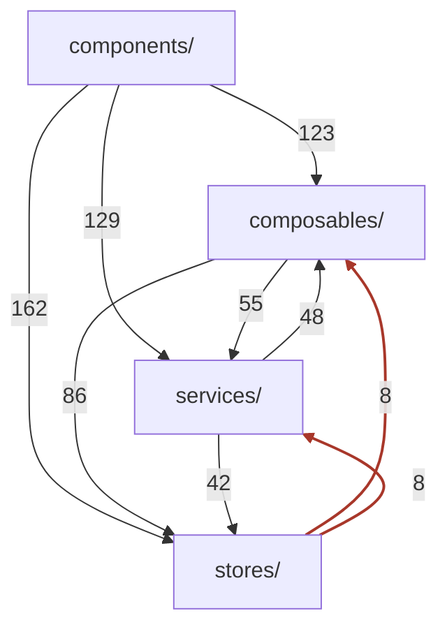
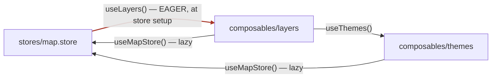

# Architecture analysis: how the layers really depend on each other

> ⚠️ **Snapshot of the code, not a maintained document.** Every figure, file name and cycle below
> was measured on branch `main` @ `44ac341` (specs and fixtures excluded) and is **not** updated as
> the code changes. Re-run the analysis before relying on any number. The *shapes* — which layers
> depend on which, and why — outlive the counts.

Findings from a full import-graph pass over `src/` — every relative and `@/` import resolved, Tarjan
over the result. This document is the evidence behind the repository's coding rules.

## 1. Components layer cleanly. Nothing below them does.

Every component edge points downward, and nothing below the component layer imports a component
(one exception, under `lidar/`). Below that line, all three remaining layers import each other in
both directions.

Edge labels are distinct file-to-file import pairs. Two things to read off it:

- The **red edges** are genuine inversions — state importing behaviour.
- The **55 / 48 pair** is an undirected band: services and composables import each other at nearly
  equal weight, so neither is "above" the other.

The four-layer folder structure is therefore a **naming convention, not a dependency
hierarchy**.

## 2. Services are singleton objects, not stateless functions

Most modules under `src/services/` declare a class and export a single instance. Many read stores.
Read the folder as "app-wide injectables with methods"; the genuinely pure members are `*.utils.ts`
and `services/api/*`.

Some do work at import time. The clearest case: `state-persistor/storage/storage.helper.ts`'s
constructor reads the persisted schema version and then writes it back — **mutating the URL** the
moment any module imports the singleton, before Pinia exists and before anything mounts.

There are two service idioms with different rules. Those in `src/services/` may touch stores.
A component-local `components/<feature>/<feature>.service.ts` holds pure logic only — only
`layer-tree` and `theme-selector` have one, and `layer-tree.service.ts` is the cleanest unit in the
repo: recursive tree transforms, type-only imports, no store access, no reactivity.

## 3. Several composables are not composables

Most are conventional. But a handful (`layers`, `ol`, `mvt-styles`, `mobile-tile`,
`offline-layers`) use **no Vue reactivity at all** — they are function namespaces invoked as
`useLayers().foo()`, which is exactly why a *store* can legally call one. A few others
(`map`, `my-maps`, `mobile-tile`) hold **module-level mutable state** and are de facto singletons:
`composables/map/map.composable.ts` keeps `let map: OlMap` at module scope, making `useMap()` a
global OpenLayers registry and the most widely imported symbol in the codebase.

Only about a quarter use `onMounted`/`onUnmounted` and are genuinely bound to a component lifecycle.

## 4. Lazy store resolution is what keeps this standing up

No service and effectively no composable calls `useXStore()` at module top level; every one resolves
its store *inside* the method that needs it (see `composables/themes/themes.composable.ts`).

This is the single convention holding the cyclic graph together. It keeps Pinia from being touched
before `createPinia()`, and it lets the circular ES-module imports resolve, because nothing
dereferences the other half of a cycle at evaluation time.

One violation exists: `composables/lidar/draw-lidar-interaction.composable.ts` calls `useMatomo()` at
module scope. It happens to be safe because that is not a Pinia store, but it breaks the pattern
everything else relies on.

## 5. Nine import cycles

| Layers spanned | Members | Note |
| --- | --- | --- |
| component, composable, service, entry | `App.vue`, `bundle/lib.ts`, `footer-bar.vue`, `toolbar-print.vue`, `print.composable`, `jobStatus.composable`, `print.service`, `LuxEncoder` | largest; drags in both entrypoints |
| store, service, composable | `draw.store`, `draw-utils.composable`, `ol-feature-drawn`, `api-mymaps.service` | crosses all three |
| store, composable | `map.store`, `layers.composable`, `themes.composable` | **hottest path** |
| store, composable | `map.store.model`, `themes.model`, `offline.model` | types only — harmless |
| component, service | `lidar/plot.ts`, `lidar-manager`, `lidar-measure` | service reaches into a component |
| store, composable | `style.store`, `mvt-styles.composable` | store calls composable |
| service | `ol-layer-feature-position.helper` ↔ `ol-layer.model` | intra-layer |
| service | `state-persistor.model` ↔ `storage/url-storage` | intra-layer |
| component | `d3-graph-elevation.vue` ↔ `elevation-profile.vue` | intra-layer |

### The hottest one, drawn out

`map.store` calls `useLayers()` in its `defineStore` setup body so `setLayerTime` can reach
`getLayerCurrentLabel` when a WMTS layer's time changes. The two composables reach back for the map
store, but only from inside their own functions. The red edge is the **only** one evaluated eagerly —
and that is why the cycle resolves instead of exploding.

## 6. The state persistor is the one fully consistent convention

Nearly every persistor implements the same `bootstrap()` → `restore()` + `persist()` triple, and the
direction is strictly one-way: the service knows the store, the store has no idea it is persisted.

The `*.mapper.ts` files are the only pure pieces — they convert between storage strings and typed
state and touch nothing else, which is why they are also the easiest things here to unit-test.

The weak point is wiring, not design: the `bootstrap()` calls are spread across several files rather
than one, two of them only run if their component mounts, and the ordering in `App.vue` is
load-bearing but recorded only as a `// Important, keep order!` comment. `bundle/lib.ts` duplicates
the sequence independently, so the two entrypoints can drift.

## 7. How components consume the rest

Roughly half of all components import a service, and a little under half import a store — but the
heaviest component→service imports are *models and classes used as types*, not behaviour. Components
mostly pull **types** out of `src/services/`.

Where behaviour is concerned, components mutate stores directly. There is no action or command layer:
`layer-manager.vue` calls `reorderLayers`, `setLayerOpacity`, `setLayerTime` and `removeLayers`
straight from its event handlers. Components also call service singletons directly, and `App.vue`
bootstraps them.

## 8. The layering shows up as a mocking burden

Services are both the most-tested layer and the most expensive to test, because so many of them reach
into stores: those specs need `createTestingPinia`, or `vi.mock` of a composable, or both —
`themes.composable` is mocked inside several *service* specs. Stores themselves are barely tested.

By contrast `layer-tree.service`, the state-persistor mappers and the `*.utils.ts` modules test with
no setup at all. That asymmetry is the practical argument for keeping new logic pure, and for
treating an expensive spec as a signal that code sits in the wrong layer.
